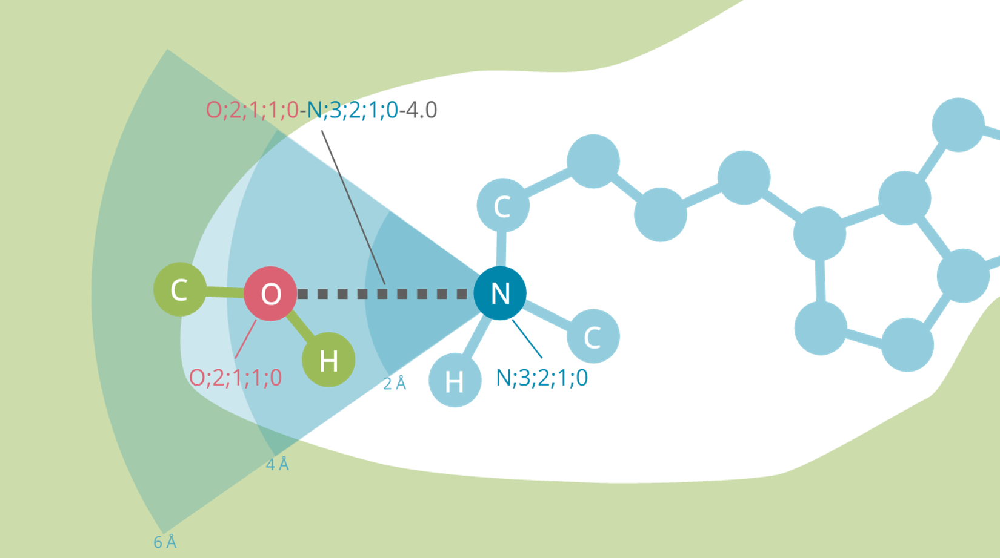

# Multi-shelled-ECIF
Improved version of extended connectivity interaction features (ECIF) by enabling to take the atomic distance into account.

## Script
* msecif_v2.py
   * Codes used to extract multi-shelled ECIF and weighted ECIF features; place in the same directory as PDB_Atom_Keys_v2.csv. 
Ex1_generate_feature.ipynb relies on this.

## Examples
1. Ex1_generate_feature.ipynb
   * Feature generation example of multi-shelled ECIF and weighted ECIF. This notebook generates Ex1_multi-shelledECIF_feature.csv and Ex1_weightedECIF_feature.csv.
3. Ex2_train_model.ipynb
   * Model training example of multi-shelled ECIF and weighted ECIF.

## Results
* FeatureParamCV
   * Cross-validation results of all conditions and all seed values. The evaluation was performed with average pearson correlation coefficient （PCC) and average root mean squared error (RMSE) of 10 runs of 10 fold cross-validation.
* GBTparamCV
   * Cross-validation results of all conditions and all seed values. The evaluation was performed with average pearson correlation coefficient （PCC) and average root mean squared error (RMSE) of 10 runs of 10 fold cross-validation.

* T-test_3ECIF
   * Evaluation results of 3 ECIFs and all seed values. The evaluation was performed with PCC and RMSE of the CASF2016 core set.

* OnlyLigandModel
   * Evaluation results of only-ligand-descriptor model and all seed values. The evaluation was performed with PCC and RMSE of the CASF2016 core set.

* LIT-PCBA
  * Evaluation results of best models of 3 ECIFs with LIT-PCBA dataset.

* FeatureImportance
   * All the permutation feature importance of the best multi-shelled ECIF model.
   * features_at_specific_distances_result.csv: Evaluation results of multi-shelled ECIF models trained by the features at specific distance. The evaluation was performed with pearson correlation coefficient (PCC) and root mean squared error (RMSE) of the CASF2016 core set.
   
## Features
* MSECIF_threshold*_step*.csv
   * Multi-shelled ECIF features of each condition.　Please unzip before use.
* WECIF_threshold*_squared*.csv
   * Weighted ECIF features of each condition.　Please unzip before use.
* RDkit_Discriptors.csv
   * Ligand descriptors generated by RDkit.
* BindingData.csv
   * Correct labels. The PDBID, pK value, and whether it is a Train set or Test set are listed.

## SampleStructures
Sample structures of 5 complexes.  
Each folders includes {PDBID}_ligand.mol, {PDBID}_ligand.sdf, {PDBID}_ligand_H_added.sdf, {PDBID}_pocket.pdb and {PDBID}_protein.pdb.   
When you generate features, please use {PDBID}_ligand_H_added.sdf for ligand file and {PDBID}_protein.pdb for protein file.

